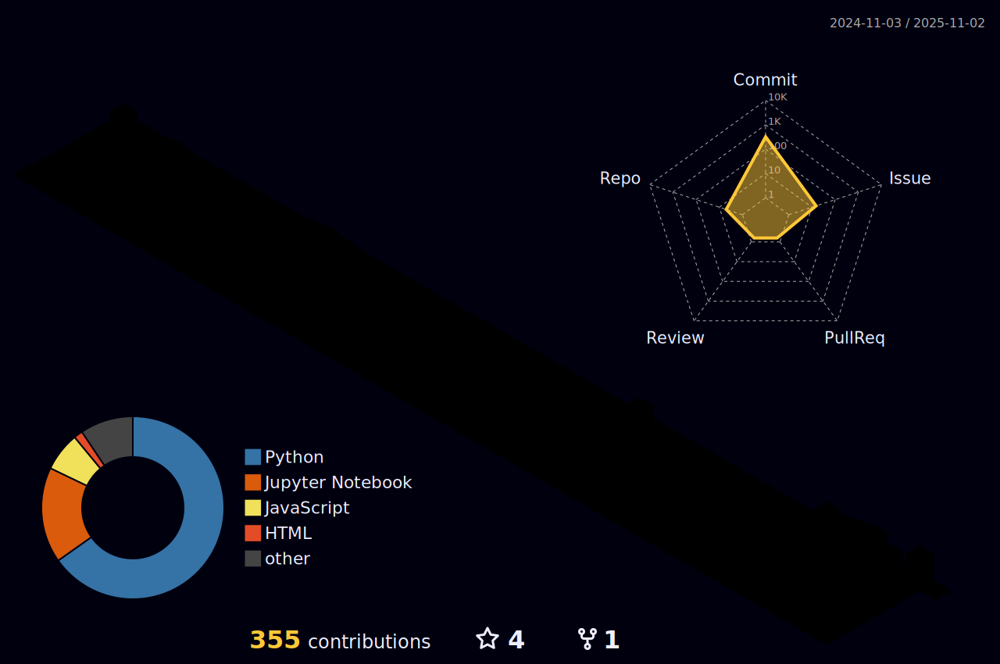

- 👋 Hi, I’m @LKSFerreira
- 👀 I'm interested in 🎮 - 🔭 - 🔬 - 📚 - 🤖 - 👨‍💻
- 💞️ I’m looking to collaborate on enthusiastic
- 📫 How to reach me

  
  

 
  
  
  
  
 

  ##

   
 
    
         

